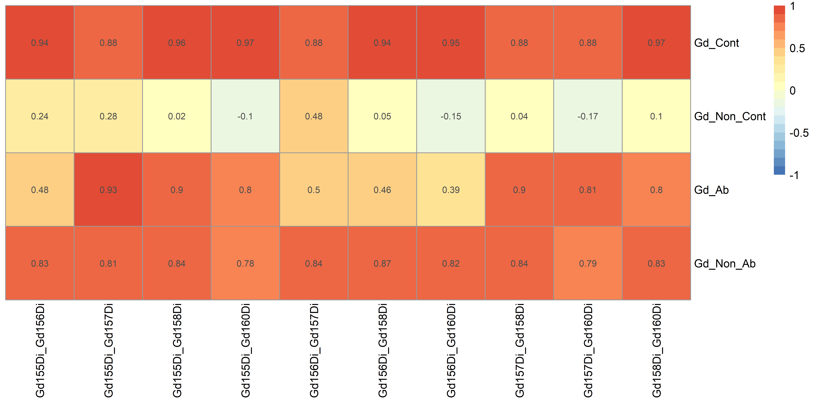

<!-- README.md is generated from README.Rmd. Please edit that file -->

```{r, include = FALSE}
knitr::opts_chunk$set(
  collapse = TRUE,
  comment = "#>",
  fig.path = "man/figures/README-",
  out.width = "100%"
)
```

# GdClean 

<!-- badges: start -->
<!-- badges: end -->

This package was designed for removing **Gadolinium contamination** in the CyTOF system, which was induced by the application of Gadolinium-based Contrast Agents in MRI screening. The deposition of Gd isotopes in tissue cells will contaminate the signal of Gd isotope-conjugated antibodies in the CyTOF system and affect data quality. The details of this method can be found in the published paper (Under Revision). 

## Installation

You can install the released version of GdClean from [GitHub](https://github.com/) with:

``` r
devtools::install_github("JunweiLiu0208/GdClean")
```

## Example

This is a basic workflow which shows you how to use this package:

```{r eval=FALSE}
library(GdClean)
library(flowCore)
library(stringr)
library(dplyr)
library(RColorBrewer)
library(pheatmap)
library(ggplot2)
library(mgcv)
library(ggpubr)

# load FCS files
# Please input your Gd contaminated Data.
fcs.dir = '../path to input directory/'
frames = lapply(dir(fcs.dir,full.names = T),read.FCS,transformation = F,alter.names = T)
names(frames) <- basename(dir(fcs.dir))
fs = as(frames,'flowSet')

# Plot Pearson's correlation coefficients across Gd channels in each CyTOF files in the flowSet.
p1 = GdCorrHeatmap(fs)
p1

```



```r

# Estimate Gd Ratios.
PercentList = seq(5,100,5)
# select Gd contaminated flowFrame object for estimating.
ff = fs[[1]] 
GdRatios = estimateGdRatio(ff,PercentList)

# Compare the estimated Ratios with Ratios of natural abundance.
p2 = GdRatioPlot(GdRatios)
p2

```


```r

# Removing Gd contamination with selected Gd ratio and method for estimating contamination coefficients.
# N_Gd = c(1,1.3831,1.0574,1.6784,1.4770) Natural Gd isotope abundance ratios.
# R_Gd = c(1,1.3084,1.0046,1.7641,1.7144) Estimated ratios calculated with control CYTOF data (Gd_Non_Ab).

gdRatio = GdRatios['5%',]
method = '1DNorm'
fs_Clean = GdClean(fs,gdRatio = gdRatio,method = method)

# Write Fcs Files after Gd Clean
inputName = dir(fcs.dir,full.names = F)
outputName = unlist(sapply(inputName, function(x){
  t1 = str_split(x,'.fcs')
  t2 = paste0(t1[[1]][1],'_GdClean.fcs')
  t2
}))

# write the cleaned files into the output directory 
write.flowSet(fs_Clean,outdir = '../path to output directory',outputName)

```


